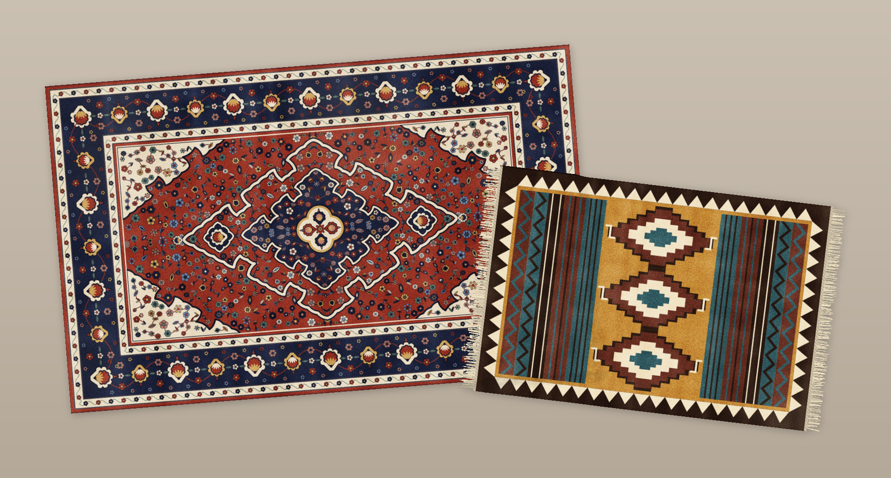

# Tapis for Linux

A cloth rug that lies on your desktop: above your icons, below every window.
Grab a corner and fold it. Curl it up. Double-click to smooth it out.



This is a Linux port of [Tapis for macOS](https://rlods.github.io/tapis/) by
Romain Lods (MIT License). The cloth simulation and rendering shaders are the
original app's own code, ported from Metal to OpenGL; the rest (grid,
constraints, constants, gestures, patterns, sounds, menus, saved data) was
recovered from the shipped app and reimplemented to behave the same.
The idea comes from a tweet by Terkel (@terkelg).

Differences from the Mac app: the cloth is tuned heavier and stiffer, like a
real wool rug (no stretching; a pulled corner drags the whole rug), with an
adjustable **Softness** (all the way to a bed sheet) and an optional **Corners
Fold Up** setting so edges curl up instead of tucking under.

## Run

```sh
./tapis.sh            # start (first run sets up .venv: numpy + PyOpenGL)
./tapis.sh --reset    # start from a fresh state
```

Needs: KDE Plasma on X11 with compositing, OpenGL 4.6 (any recent GPU/Mesa),
Python 3 with PyQt6 (`sudo apt install python3-pyqt6`), a C compiler for the
fabric sounds (optional), and `pw-cat` or `pacat` for audio.

## Use

Everything happens with the mouse on the rug, and from the Tapis icon in the
system tray.

- **Fold it**: drag any part of the rug. Folds stay. Double-click smooths it out.
- **Long press to edit**: hold still on a rug for half a second. Then drag to
  move it, drag a corner to resize (Shift: evenly), drag the top knob to rotate
  (Shift: 15° steps). Click the rug again, or anywhere else, when done.
- **Toolbar** under a selected rug: Design, Smooth out, Rotate 90°,
  Fill screen (click again to restore), Place below/above icons, Remove.
- **Tray menu**: Add Rug, Hide Rugs, Rearrange Rugs (to reach rugs below the
  icons), arrangements (New, Duplicate, Rename, Delete), Fabric Sounds, Open at
  Login, About, Quit. Hold Alt while opening it for "Refresh Desktop Icons".

Desktop icons are found through KDE's accessibility bus (only their
positions and names); a rug placed "below icons" gets the icons redrawn on
top of it, because Plasma draws wallpaper and icons as one layer.

State is saved in `~/.config/tapis/settings.json`. Nothing leaves your machine.

## Layout

```
tapis.sh               launcher
tapis/app.py           tray icon, menu, dialogs
tapis/controller.py    60 Hz loop, gestures, selection, arrangements
tapis/cloth.py         cloth simulation host (drives shaders/cloth.glsl)
tapis/renderer.py      shadow, rug, fur and rim passes (shaders/render.glsl)
tapis/window.py        per-screen desktop-layer window + overlay
tapis/patterns.py      procedural rug designs; palettes.py the presets
tapis/design_panel.py  the Rug Design window
tapis/audio.py         fabric sounds (synth in native/fabric.c)
tapis/icons.py         desktop icon positions; icon_layer.py icons over rugs
tapis/store.py         saved state; tr.py + locale/ translations
```
